# Azure OpenAI 使用指南

#### Rade Zheng
技术更新太快，请注意文档更新日期

[帐号部署](./readme.md#帐号部署)
  
[部署模型](./readme.md#部署模型)

[开始聊天](./readme.md#开始聊天)

[密钥和Endpoint](./readme.md#密钥和endpoint)

[访问安全](./readme.md#访问安全)

[可用版本与区域](./readme.md#可用版本与区域2024-01-08)

[Tokens – 计费单位](./readme.md#tokens--计费单位)

[Token 计数](./readme.md#token-计数)

[服务配额和限制](./readme.md#服务配额和限制)

[所有模型都有默认配额（速率限制）](./readme.md#所有模型都有默认配额速率限制)

[增加配额的方式](./readme.md#增加配额的方式)

[专用容量 - Provisioned Throughput Unit](./readme.md#专用容量---provisioned-throughput-unit)

[内容管理系统 Azure OpenAI 会增加内容过滤以确保合规，以防止服务滥用和生成有害内容](./readme.md#内容管理系统-azure-openai-会增加内容过滤以确保合规以防止服务滥用和生成有害内容)

[自定义筛选器 –调到最高降低内容过滤的敏感性](./readme.md#自定义筛选器-调到最高降低内容过滤的敏感性)

[数据合规和隐私保护](./readme.md#数据合规和隐私保护)

[负载均衡+网络加速](./readme.md#负载均衡网络加速)

[网络优化 - 专线+私有链接](./readme.md#网络优化---专线私有链接)

[使用方式](./readme.md#使用方式)

[提示工程指南](./readme.md#提示工程指南)

[如需私域数据，优先方案: 检索增强生成(RAG) - 拓展GPT的知识边界](./readme.md#如需私域数据优先方案-检索增强生成rag---拓展gpt的知识边界)

[微调: 使用特定域数据进行模型调整](./readme.md#微调-使用特定域数据进行模型调整)

[什么时候用微调？](./readme.md#什么时候用微调)

[RAG LLM App Stack](./readme.md#rag-llm-app-stack)

[Architecture - LLM Stack on Azure](./readme.md#architecture---llm-stack-on-azure)

[内部探索Azure OpenAI的能力与场景 部署方式 – 建议参考这些开发更具商业化的客户端。](./readme.md#内部探索azure-openai的能力与场景-部署方式--建议参考这些开发更具商业化的客户端)

[内部知识库/QA客户类应用测试](./readme.md#内部知识库qa客户类应用测试)

[Copilot定制开发的框架](./readme.md#copilot定制开发的框架)

# 帐号部署
### 一个订阅可多区域部署Azure OpenAI服务，TPM按区域单独统计
[https://portal\.azure\.com](https://portal.azure.com/)
#### 搜索"OpenAI"，创建资源
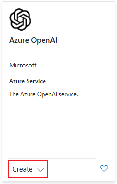

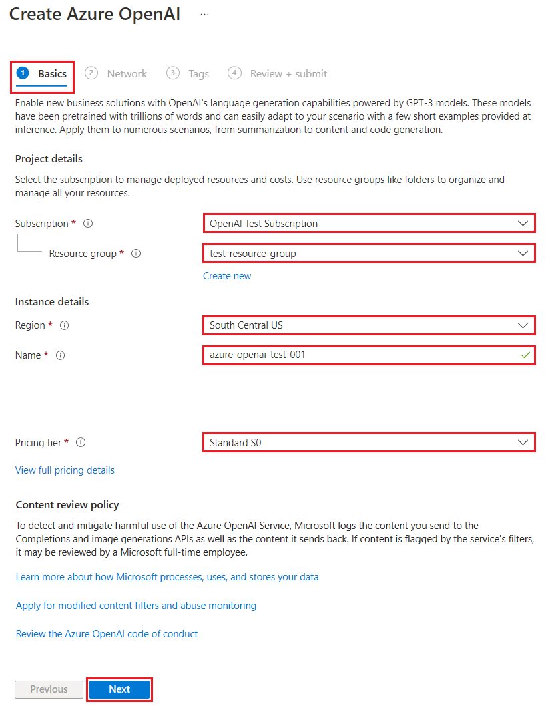

[操作说明：创建和部署  Azure OpenAI  服务资源  \- Azure OpenAI | Microsoft Learn](https://learn.microsoft.com/zh-cn/azure/ai-services/openai/how-to/create-resource?pivots=web-portal)

# 部署模型
#### https://oai.azure.com/

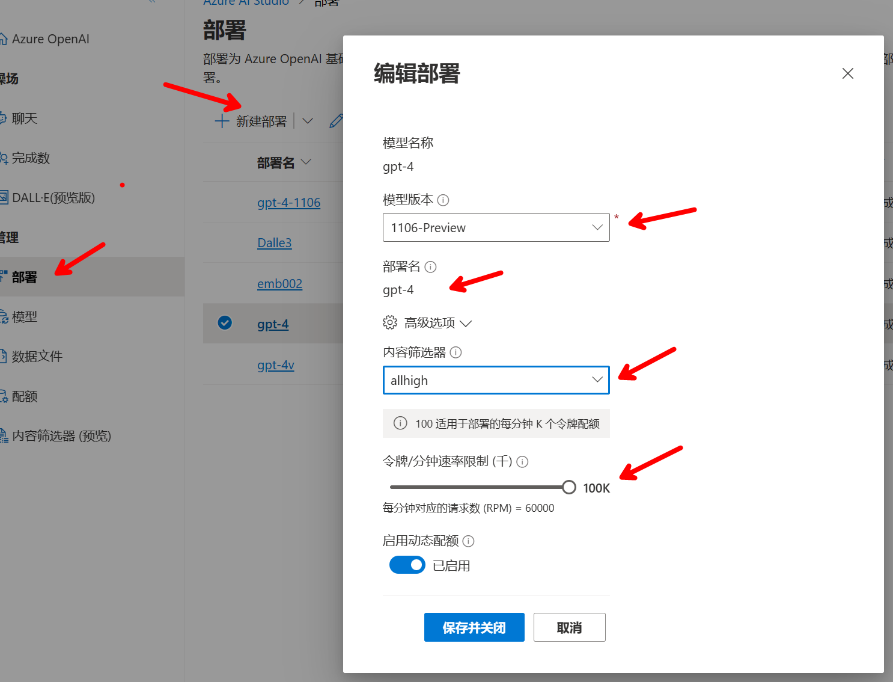

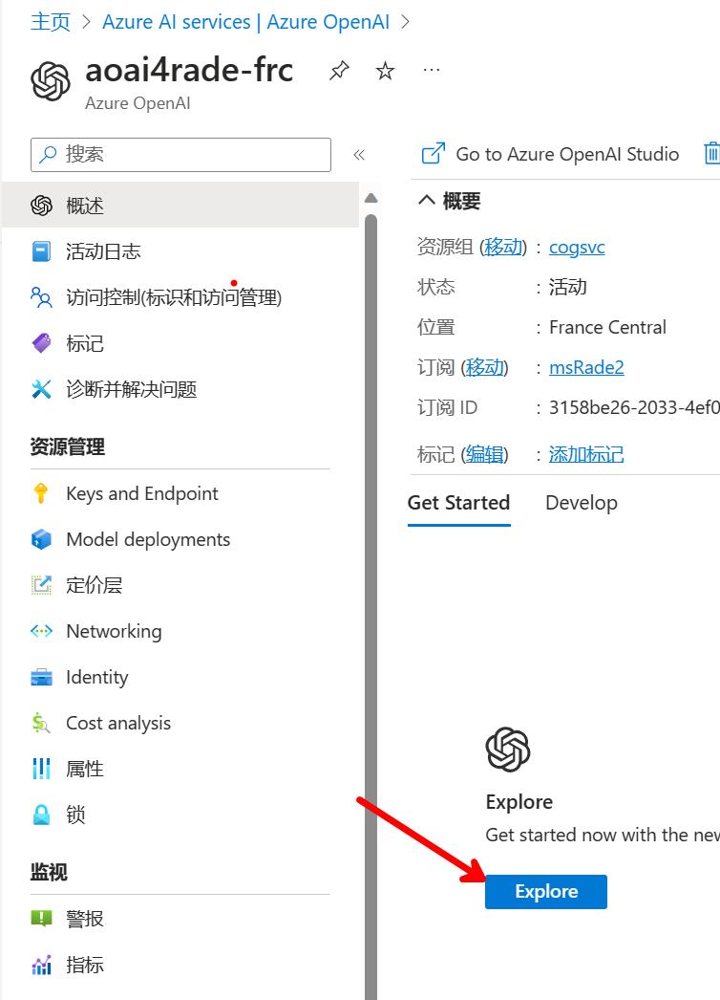

TPM按需要可调到最大\(按区域统计\)

内容筛选器自定一个，都调到最高。

[操作说明：创建和部署 Azure OpenAI  服务资源  \- Azure OpenAI | Microsoft Learn](https://learn.microsoft.com/zh-cn/azure/ai-services/openai/how-to/create-resource?pivots=web-portal#deploy-a-model)

# 开始聊天

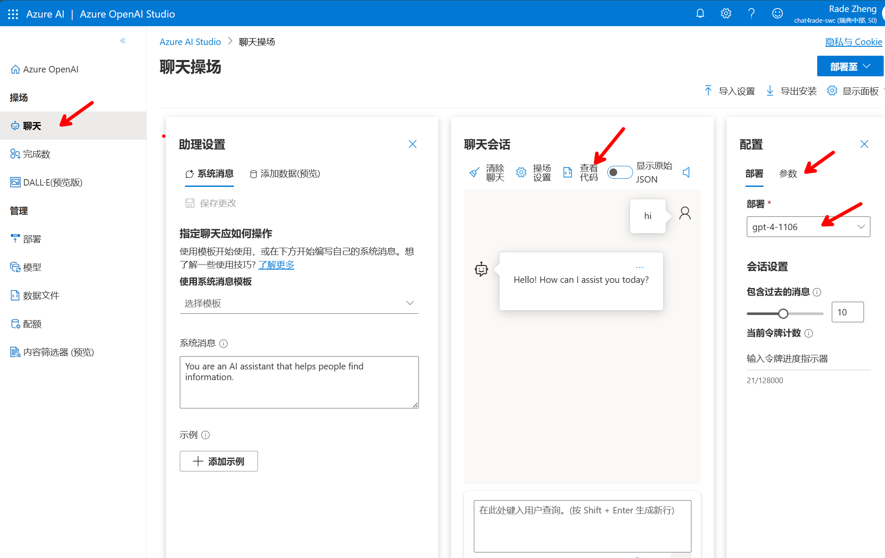

# 密钥和Endpoint

[https://portal\.azure\.com](https://portal.azure.com/)
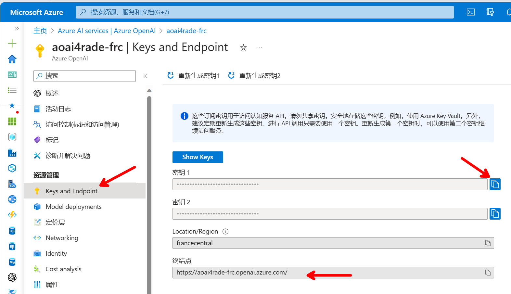

- API调用时用的 __engine__ 名称为上面部署模型时使用的 __部署名__ 。

- 用Python SDK\, 注意 1\.x 版本与之前的差异

[快速入门：开始通过 Azure OpenAI 服务使用GPT\-35\-Turbo and GPT\-4 \- Azure OpenAI Service | Microsoft Learn](https://learn.microsoft.com/zh-cn/azure/ai-services/openai/chatgpt-quickstart?tabs=command-line&pivots=programming-language-python)

- 迁移openai\.com上的应用代码转换参考：

[如何使用 Python 在 OpenAI  和  Azure OpenAI  服务终结点之间进行切换  \- Azure OpenAI Service | Microsoft Learn](https://learn.microsoft.com/zh-cn/azure/ai-services/openai/how-to/switching-endpoints)

- 基于Azure OpenAI的应用基础代码参考，如内容生成，chat, embedding等：
[openai / openai \-cookbook: Examples and guides for using the OpenAI API \(github\.com\)](https://github.com/openai/openai-cookbook)

# 访问安全

内网访问 \- 需VPN或专线

[为  Azure AI  服务配置虚拟网络  \- Azure AI services | Microsoft Learn](https://learn.microsoft.com/zh-cn/azure/ai-services/cognitive-services-virtual-networks?tabs=portal)

限定帐户访问

[如何使用托管标识配置  Azure OpenAI 服务 \- Azure OpenAI | Microsoft Learn](https://learn.microsoft.com/zh-cn/azure/ai-services/openai/how-to/managed-identity)

[Azure OpenAI 的基于角色的访问控制 \- Azure AI services | Microsoft Learn](https://learn.microsoft.com/zh-cn/azure/ai-services/openai/how-to/role-based-access-control)

# 可用版本与区域(2024-02-12)

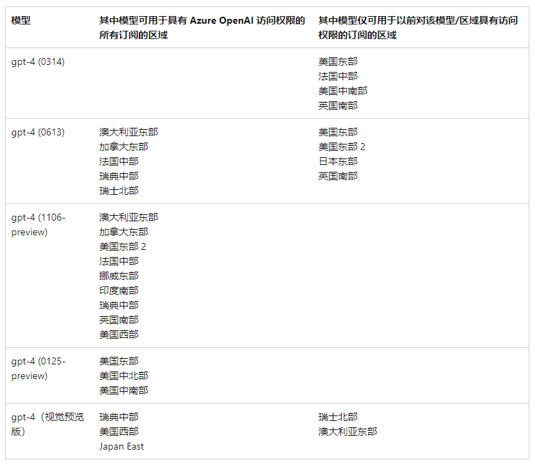

更详细请参考在线文档: [Azure OpenAI 服务模型 \- Azure OpenAI | Microsoft Learn](https://learn.microsoft.com/zh-cn/azure/ai-services/openai/concepts/models)

[不同区域的网络延迟(不包括API)测试, 从当前浏览器所在网络发起](https://www.azurespeed.com/Azure/Latency)
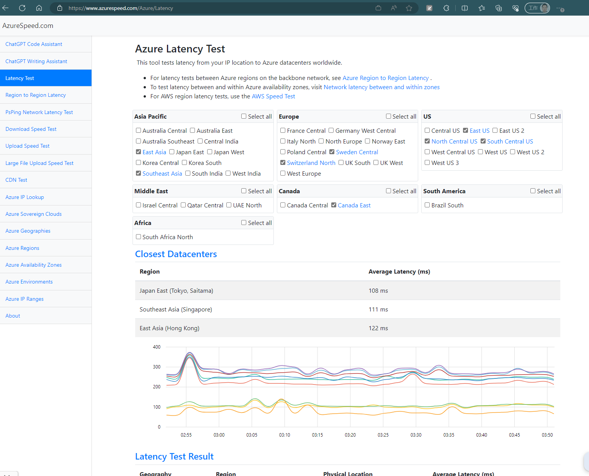

# Assistant API (助手)
[快速入门：开始使用 Azure OpenAI 助手（预览版）](https://learn.microsoft.com/zh-cn/azure/ai-services/openai/assistants-quickstart?tabs=command-line&pivots=programming-language-studio)

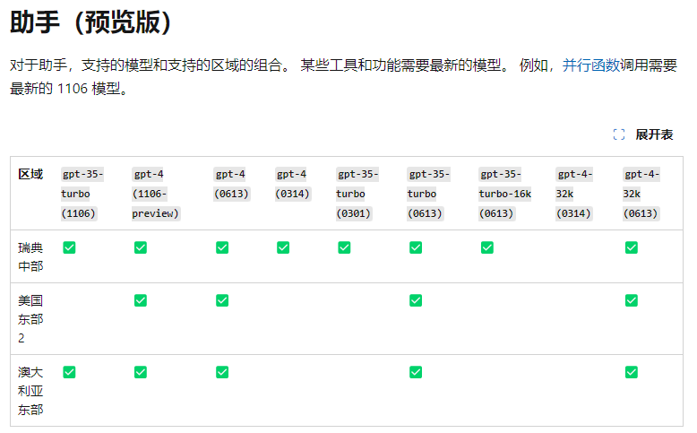
# Tokens – 计费单位

每个AOAI资源都提供一定的吞吐量，具体取决于模型

吞吐量以每分钟令牌数 （TPM） 为单位

Token = 单词的一部分（有时是完整的单词）

用[OpenAI tokenizer](https://platform.openai.com/tokenizer)快速估计

对于一个用例的成本，我们需要弄清楚它每分钟使用多少个令牌才能预估

Completion tokens

| 语言 | Tokens/词(字) |
| :-: | :-: |
| en-us | ~ 1.3 tokens |
| de-de | ~ 2.3 tokens |
| zh-cn | ~ 2.0 tokens |

# Token 计数

- 非流式API调用会直接返回token计数。
- [OpenAI Platform](https://platform.openai.com/tokenizer) 提供Tokenizer\,

- python: [openai / tiktoken : \(github\.com\) gpt\-3\-encoder ](https://www.npmjs.com/package/gpt-3-encoder)
- [npm  \(npmjs\.com\)](https://www.npmjs.com/package/gpt-3-encoder)

流式响应没有带token计数，可以使用Azure Functions用上面的lib进行自行实时计数。参考右边架构。

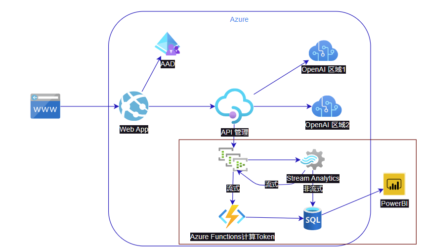

Azure Functions 代码参考 : [radezhen / tkcount  \(github\.com\)](https://github.com/radezheng/tkcount)

# 服务配额和限制
#### 可在AOAI Studio查看和调整
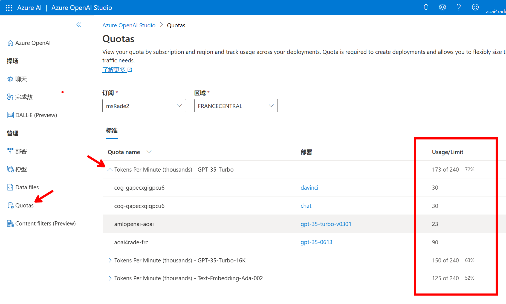

[Azure OpenAI  服务配额和限制  \- Azure AI services | Microsoft Learn](https://learn.microsoft.com/zh-cn/azure/ai-services/openai/quotas-limits?branch=release-azure-openai-preview)

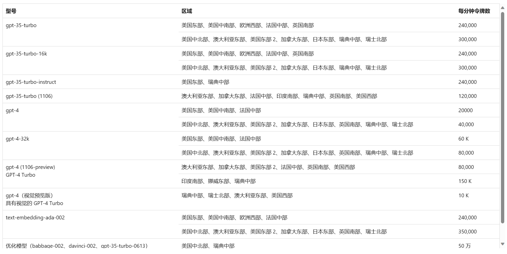

1K TPM 可获得 6 RPM\(Requests/分钟\)

240K TPM -> 240 \* 6 = 1440 RPM

# 所有模型都有默认配额（速率限制）

配额 （ TPM ） 是按区域、按模型设置的

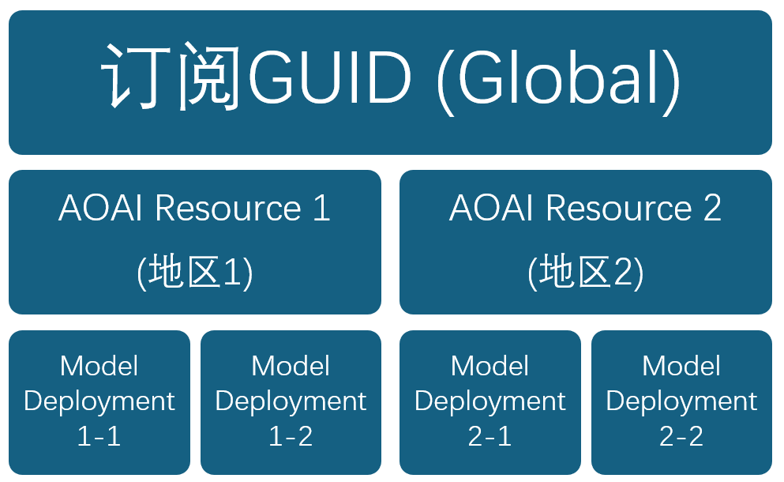
对于单个订阅 GUID，可以
- 多个Azure OpenAI服务, 如每个区域一个
- 每个Azure OpenAI服务创建一个或多个模型 (同一区域同一模型版本共享最大TPM数)

# 增加配额的方式

- 多区域负载均衡

- \[不建议\] 开case [Azure OpenAI  服务配额和限制  - Azure AI services | Microsoft Learn](https://learn.microsoft.com/zh-cn/azure/ai-services/openai/quotas-limits#how-to-request-increases-to-the-default-quotas-and-limits)

- 专用容量\(PTU\) – 后面介绍

如：使用APIM 做网关实现多区域负载均衡。 总TPM = 区域数 \* 模型最大TPM
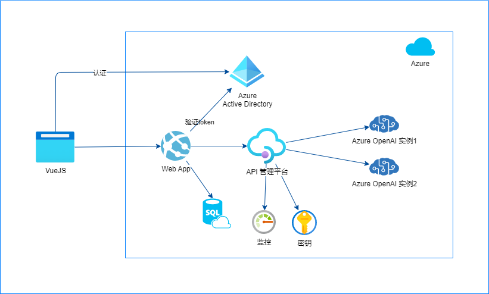

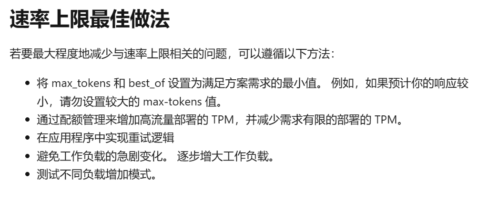

参考 [管理 Azure OpenAI 服务配额  \- Azure AI services | Microsoft Learn](https://learn.microsoft.com/zh-cn/azure/ai-services/openai/how-to/quota?tabs=rest#rate-limit-best-practices)

# 专用容量 - Provisioned Throughput Unit

###  可预测的性能
  * 稳定的延迟和吞吐量，适用于统一的工作负载
###  预留容量
  * 确保处理能力能够满足需求
###  节省成本
  * 与PayGo相比，大容量工作负载可以节省成本

*_目前需要内部申请购买，如有需要请联系微软_

| Model | TPM for 最少容量 |  | TPM  递增 |  |
| :-: | :-: | :-: | :-: | :-: |
| GPT3.5-turbo(4K) | 300 PTUs | 900K – 2.7M TPM | 100 PTUs | +300K – 900K TPM |
| GPT4-8K | 900 PTUs | v0314: 126K – 378K TPM v0613: 216K – 648K TPM | 300 PTUs | v0314: +42K – 126K TPM v0613: +72K – 216K TPM |
| GPT4-32K | 1800 PTUs | v0314: 252K – 756K v0613: 432K – 1,296K TPM | 600 PTUs | V0314: +84K – 252K TPM V0613: +144K – 432K TPM |

# 内容管理系统 Azure OpenAI 会增加内容过滤以确保合规，以防止服务滥用和生成有害内容

  __最佳做法__ 

 在应用程序的设计中，请考虑以下最佳做法，以提供积极的应用程序体验，同时最大程度地减少潜在危害：

 - 确定你希望如何处理用户发送的提示中包含分类为某个筛选类别和严重性级别的内容或者用户滥用应用程序的情况。

 - 检查    finish\_reason    以查看是否已完成筛选。

 - 检查    content\_filter\_result    中是否没有错误对象（表示未运行内容筛选）

[Azure OpenAI  服务内容筛选  \- Azure OpenAI | Microsoft Learn](https://learn.microsoft.com/zh-cn/azure/ai-services/openai/concepts/content-filter)

这个会影响流式的响应，可申请关闭或调整过滤规则。需要时间，建议先调整过滤规则。

[Azure OpenAI Limited Access Review: Modified Content Filters and Abuse Monitoring \(microsoft\.com\)](https://customervoice.microsoft.com/Pages/ResponsePage.aspx?id=v4j5cvGGr0GRqy180BHbR7en2Ais5pxKtso_Pz4b1_xURE01NDY1OUhBRzQ3MkQxMUhZSE1ZUlJKTiQlQCN0PWcu)

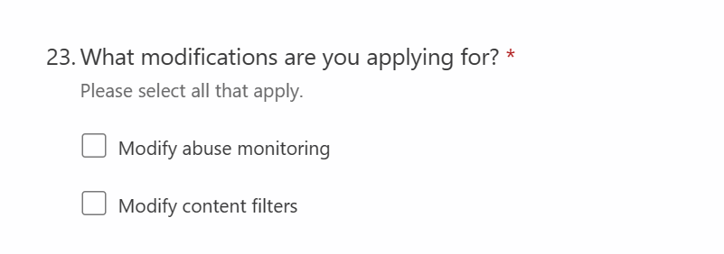

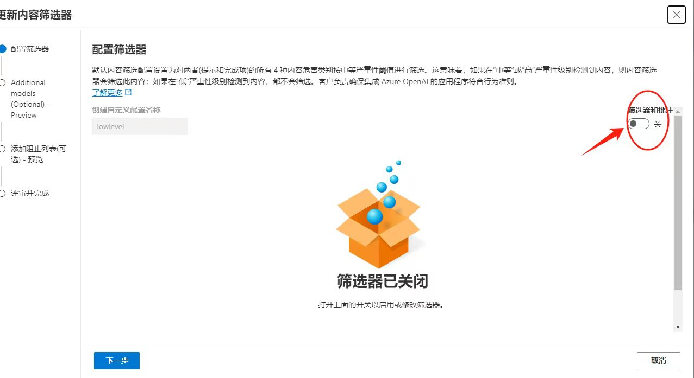

# 自定义筛选器 –调到最高降低内容过滤的敏感性

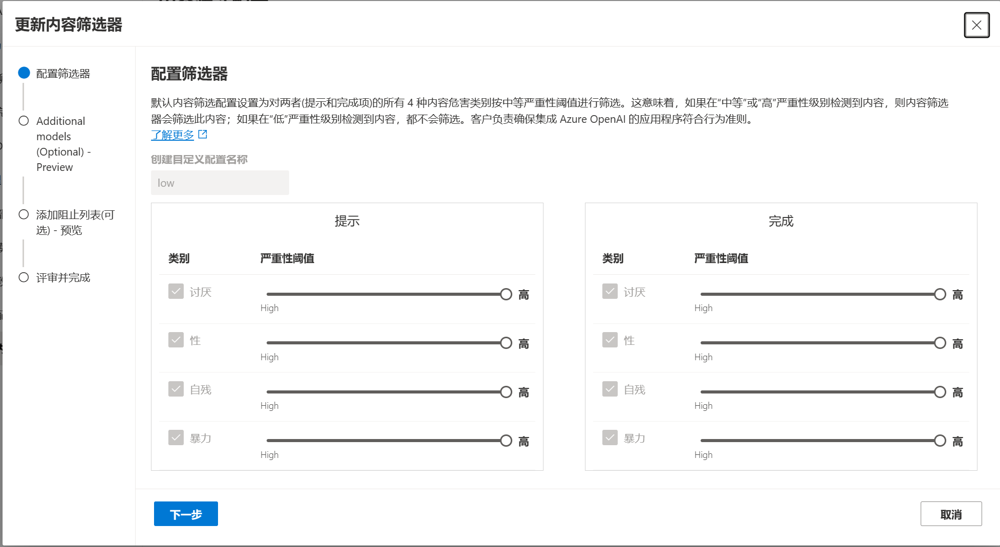

# 数据合规和隐私保护

*  提示（输入）和完成（输出）、嵌入和训练数据：
  *  不会发送给任何其他客户。
不会发送到    OpenAI   。
不会用于改进    OpenAI    模型。
不会用于改进任何   Microsoft   或第三方产品或服务。
不会用于自动改进    Azure OpenAI    模型以供在资源中使用（这些模型是无状态的，除非使用训练数据显式微调模型）。
经过微调   \(fine\-tune\)   的    Azure OpenAI    模型仅供您使用。
*  Azure OpenAI    服务完全由    Microsoft    控制   ;Microsoft   在   Microsoft   的   Azure   环境中托管   OpenAI   模型，并且服务不与   OpenAI   运营的任何服务（例如   ChatGPT   或   OpenAI API   ）进行交互。

[Data\, privacy\, and security for Azure OpenAI Service \- Azure AI services | Microsoft Learn](https://learn.microsoft.com/zh-cn/legal/cognitive-services/openai/data-privacy)

# 负载均衡+网络加速

### 方式一：最简单 \- 网络加速，单一Endpoint \(或自己在本地做负载\)

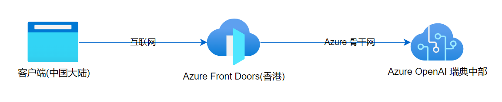

[使用  Azure Front Door  转发  Azure OpenAI \[ 防火墙功能可选 \] | Microsoft Learn](https://learn.microsoft.com/zh-cn/azure/web-application-firewall/afds/protect-azure-open-ai#create-an-azure-front-door-instance-with-azure-waf)

### 方式二：APIM 网络加速，负载均衡，可配出错轮询策略

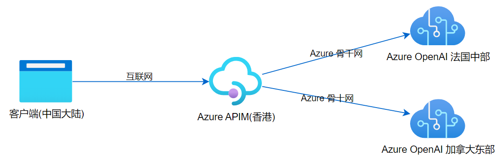

[通过Azure API管理服务（APIM）解决Azure OpenAI Token限制问题 \(qq\.com\)](https://mp.weixin.qq.com/s/gdite9Xd1NmqSzu9-TKdAw)

### 方式三: 自定义网关实现 - 负载均衡+网络加速

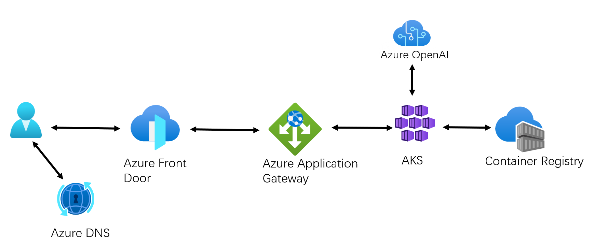

# 网络优化 - 专线+私有链接 
### 提升网络稳定性，降低延迟
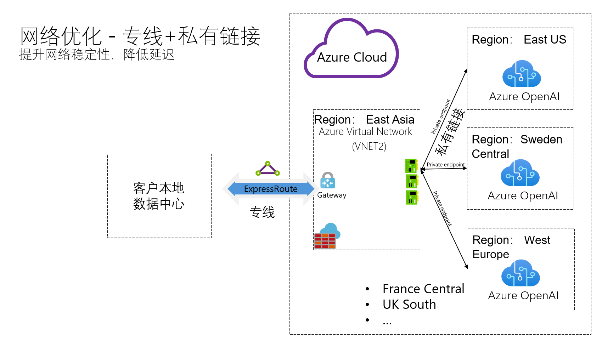

# 使用方式

  - __[提示工程  Prompt Engineering](https://learn.microsoft.com/zh-cn/azure/ai-services/openai/concepts/prompt-engineering)__    是一种涉及为自然语言处理模型设计提示   \(   提问   \)   的技术。此过程提高了响应的准确性和相关性，从而优化了模型的性能。

  - __[检索增强生成 Retrieval Augmented Generation \(RAG\)](https://learn.microsoft.com/zh-cn/azure/machine-learning/concept-retrieval-augmented-generation?view=azureml-api-2)__    通过从外部源检索数据并将其合并到提示中来提高   LLM   性能。   RAG    允许企业实现定制解决方案，同时保持数据相关性并优化成本   \.

  - __[微调 Fine\-tuning](https://learn.microsoft.com/zh-cn/azure/ai-services/openai/how-to/fine-tuning?pivots=programming-language-studio)__    使用示例数据调整现有的大模型   \(LLM\)   ，从而产生针对提供的示例进行优化的新“自定义” 大模型   \(LLM\)   \.

# 提示工程指南

使用语言提示生成高质量文本输出的说明和最佳做法

Start with clear instructions

Prime the output

Add clear syntax

Few\-shot learning

Few\-Shot Reasoning

Break the task down

Meta prompts / System Message / Guardrails

Use affordances/tools when needed

Chain of thought prompting

Fine\-Tuning with Chain\-of\-Thought

Use quotes to generate a single sentence

Specifying output structure

Adjusting 'Temperature' and ‘Top\_P’ parameters

[Azure OpenAI 的提示工程技术 \- Microsoft Learn](https://learn.microsoft.com/zh-cn/azure/ai-services/openai/concepts/advanced-prompt-engineering?pivots=programming-language-chat-completions)

---

# 如需私域数据，优先方案: 检索增强生成(RAG) - 拓展GPT的知识边界

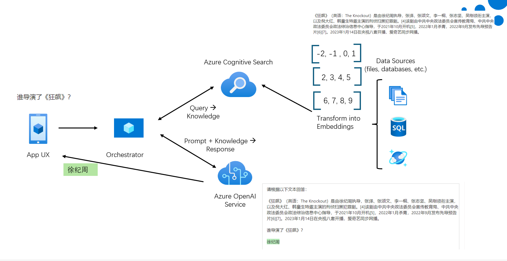

# 微调: 使用特定域数据进行模型调整

_Fine\-tuning_   结果是使用更新的权重和偏差生成的新模型 \.

慎重使用，对训练数据质量要求高，结果质量难预料。

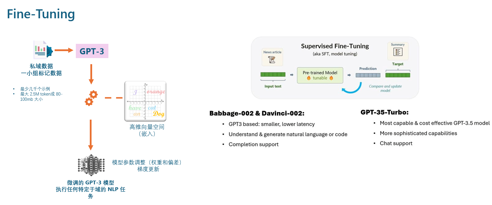

# 什么时候用微调？

* 提示工程是推荐的路径
  * Zero Shot\, and Few Shot
* RAG帮助注入企业私有和最新知识\.
* 您可以组合模型\(e\.g\.\, a FT’d GPT3 – Curie model in a classifier\)
* Prompt Engineering \+ RAG 可解决 ~99% 的场景需求
* RAG 和 微调\(FT\) 是不同的技术，解决不同的问题\.
* FT:
* FT 是解决复杂场景的强大技术
  * 计算密集型，因此成本高昂
* 不会在模型中提炼新知识
* 适用于高度专业化的用例 （~0\.5%）
* FT 并不总是降低成本 \- 取决于用例

# RAG LLM App Stack

Source: [https://a16z\.com/emerging\-architectures\-for\-llm\-applications/](https://a16z.com/emerging-architectures-for-llm-applications/)

# Architecture \- LLM Stack on Azure
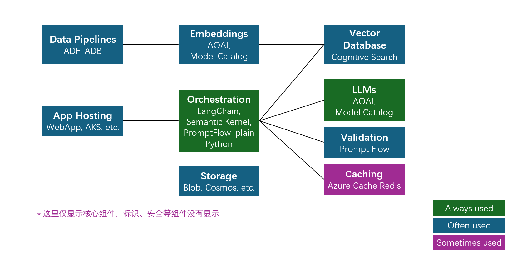

# 内部探索Azure OpenAI的能力与场景 部署方式 – 建议参考这些开发更具商业化的客户端。

* 类Azure OpenAI Studio应用
  * [https://github\.com/microsoft/sample\-app\-aoai\-chatGPT](https://github.com/microsoft/sample-app-aoai-chatGPT)
* 支持自定义Dataground多bot应用
  * [https://github\.com/radezheng/tsgptAAD](https://github.com/radezheng/tsgptAAD)

# 内部知识库/QA客户类应用测试

* 使用Azure Search作为embedding知识库
  * Python版本:[https://github\.com/Azure\-Samples/azure\-search\-openai\-demo/](https://github.com/Azure-Samples/azure-search-openai-demo/)
  * Pyhton版本部署参考指南: [radezheng /ai\-search\-demo\-guide \(github\.com\)](https://github.com/radezheng/ai-search-demo-guide)
  * [其他语言版本](https://github.com/Azure-Samples/azureai-samples/tree/main?tab=readme-ov-file#azure-ai-search)

# 企业部署参考架构
* [企业级架构](https://learn.microsoft.com/zh-cn/azure/architecture/ai-ml/architecture/baseline-openai-e2e-chat)
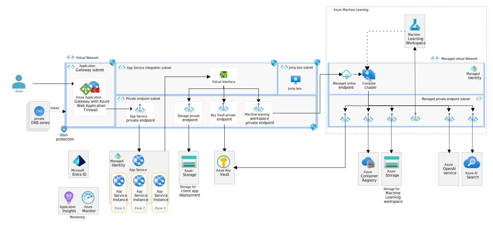
* [github sample](https://github.com/azure-Samples/openai-end-to-end-baseline)

# Copilot定制开发的框架

* Semantic Kernel
  * [Orchestrate your AI with Semantic Kernel | Microsoft Learn](https://learn.microsoft.com/zh-cn/semantic-kernel/overview/)
* Langchain
  * [🦜️🔗  LangChain ](https://docs.langchain.com/docs/)

